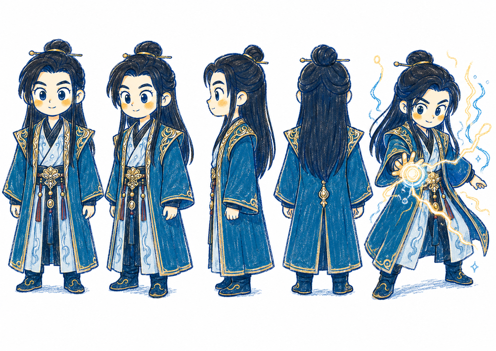
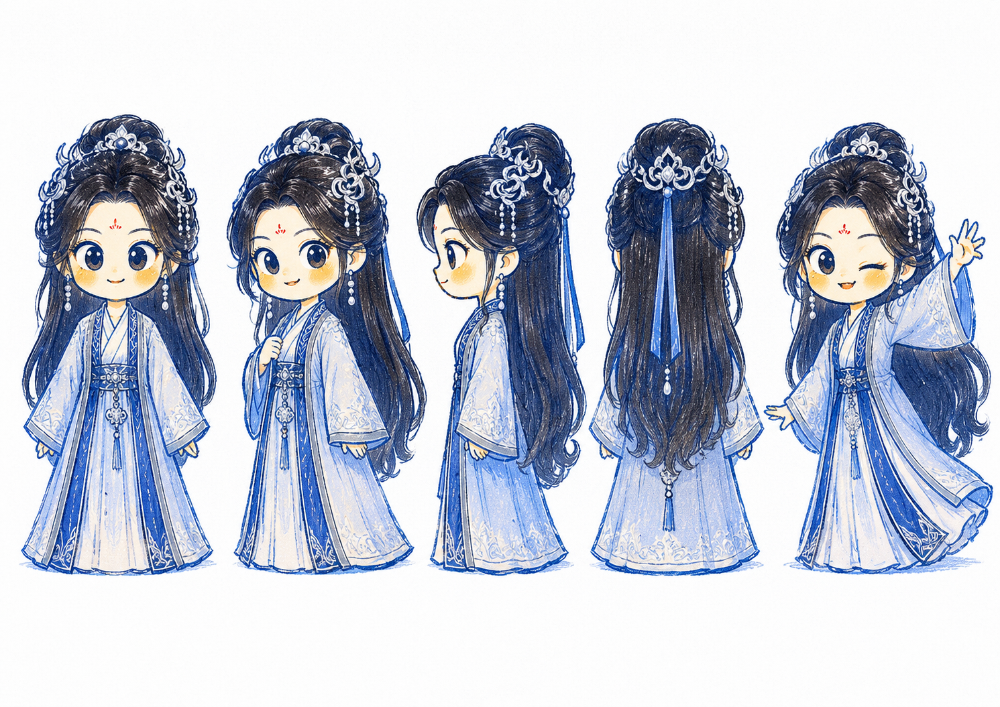
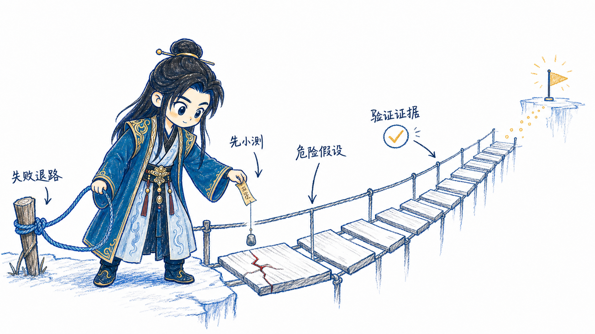
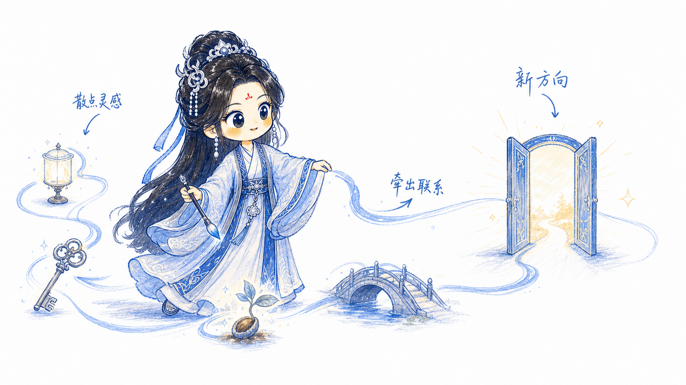
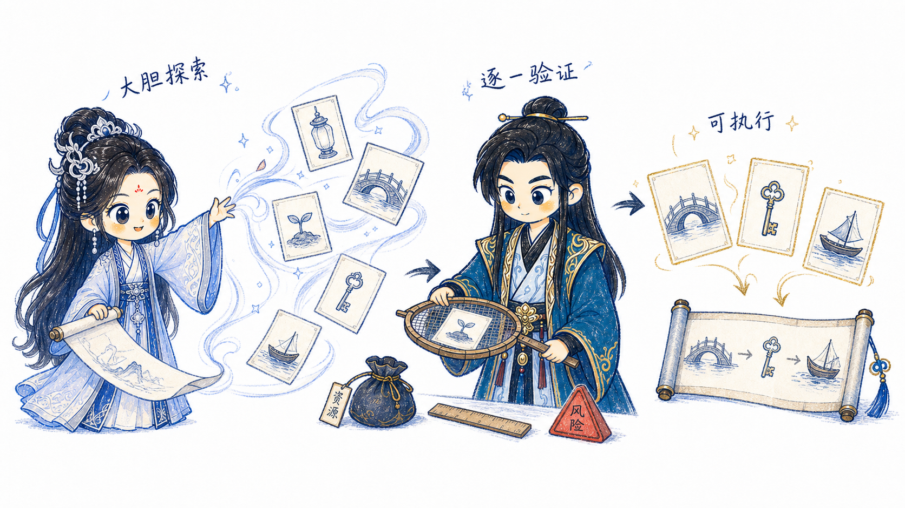

# Luofu Illustrations

> 韩立 × 南宫婉双角色 | 16:9 白底手绘 | 中文文章正文配图 | Codex Skill

Luofu Illustrations 用韩立与南宫婉这对互补角色，把中文文章中的判断、流程、状态和隐喻画成清爽的正文配图。

它不是角色立绘生成器，也不是仙侠海报模板。Skill 会先理解内容需要什么认知功能，再选择韩立、南宫婉或二人同场，让角色实际参与结构运转。

## 双角色

### 韩立

沉稳、谨慎、克制、善于观察和准备。适合风险、验证、证据、规划、复盘、资源管理与系统稳定。



### 南宫婉

可爱灵动是表层气质，人物骨架是温和克制、清醒自主、柔中有锋。适合灵感、探索、连接、激活、引导和轻盈表达。



### 什么时候让二人同场

只在内容需要表达互补、权衡或协作时同场，例如：

- 探索与验证
- 发散与收敛
- 速度与质量
- 机会与风险
- 行动与复盘
- 长期协作与交接

二人是平等、克制、长期互信的道侣。默认不靠拥抱、撒糖和粉色氛围表达关系，而通过交接、补位、共同承担和相互保护表达默契。

## 视觉语言

- 16:9 横版正文配图
- 纯白背景和大量留白
- 蓝黑铅笔/蜡笔式手绘线条
- 深蓝、浅蓝、银蓝与金色角色配色
- 少量红色关键提醒和固定识别点
- 3-5 个短中文手写标注
- 一个画面只表达一个核心结构
- 角色设定图只用于身份与外观，不复制五视图排版

## 示例效果

### 韩立：先验证风险，再行动



### 南宫婉：连接灵感，形成新方向



### 双角色：先大胆探索，再逐一验证



三张样片分别展示韩立单人、南宫婉单人和双角色协作。实际使用时应根据文章重新设计隐喻，不要机械复刻桥、丝带、筛盘或卡片构图。

## 安装

```bash
git clone https://github.com/Yun-Tianming/luofu-illustrations.git
cd luofu-illustrations
mkdir -p "$HOME/.agents/skills"
cp -R ./luofu-illustrations "$HOME/.agents/skills/"
```

安装后重启 Codex。

## 使用

### 规划一篇文章的配图

```text
Use $luofu-illustrations 先不要生图。
分析下面文章的认知锚点，输出约 5 张 shot list。
每张说明选韩立、南宫婉还是双角色，以及角色为什么适合这个概念。

<粘贴文章>
```

### 直接生成

```text
Use $luofu-illustrations 为下面文章生成 4 张正文配图。
根据内容自动选角，不要为了情侣感强行让两人同框。

<粘贴文章>
```

### 单张概念图

```text
Use $luofu-illustrations 为“先大胆探索，再谨慎验证”生成一张图。
让南宫婉负责展开可能性，韩立负责筛选和校准，两人的动作形成明确因果。
```

更多调用方式见 [`examples/prompts.md`](examples/prompts.md)。

## 工作方式

1. 提炼文章中的认知锚点。
2. 根据内容选择韩立、南宫婉或双角色。
3. 为角色设计真正承担概念的动作。
4. 调用图像模型时传入对应角色设定图。
5. 生成一个完整叙事场景，而不是设定表或排排站。
6. 按角色一致性、互动能动性、留白、文字与构图进行 QA。

## 目录

```text
.
├── README.md
├── LICENSE
├── NOTICE.md
├── examples/
│   ├── prompts.md
│   ├── showcase/
│   │   ├── 01-hanli-risk-validation.png
│   │   ├── 02-nangongwan-connect-inspiration.png
│   │   └── 03-duo-explore-verify.png
│   └── legacy-*/
└── luofu-illustrations/
    ├── SKILL.md
    ├── agents/
    │   └── openai.yaml
    ├── assets/
    │   └── characters/
    │       ├── han-li-character-sheet.png
    │       └── nangong-wan-character-sheet.png
    └── references/
        ├── character-duo.md
        ├── style-dna.md
        ├── composition-patterns.md
        ├── prompt-template.md
        └── qa-checklist.md
```

真正安装到 Codex 的目录是 `luofu-illustrations/`。

## 人物灵感与边界

韩立与南宫婉的人格及道侣关系灵感来自忘语小说《凡人修仙传》。本 Skill 是非官方衍生用途；角色外观以仓库内由维护者提供的两张 Q 版手绘设定图为准，不复刻动画、真人影视或游戏造型。

- [《凡人修仙传》起点作品页](https://www.qidian.com/book/107580/)
- [《凡人修仙传》哔哩哔哩动画页面](https://www.bilibili.com/bangumi/media/md28223043)

## 项目归属

Luofu Illustrations 由 [Yun-Tianming](https://github.com/Yun-Tianming) 维护。韩立 × 南宫婉双角色系统、选角规则、提示词模板、角色参考资产和当前示例共同构成这个 fork 的独立项目身份。

许可文本及必要的第三方、上游说明分别保留在 [`LICENSE`](LICENSE) 与 [`NOTICE.md`](NOTICE.md)，不参与当前项目的品牌表达。旧“小黑”样例只保留在 `examples/legacy-*`，不会进入当前 Skill 的生成路径。
